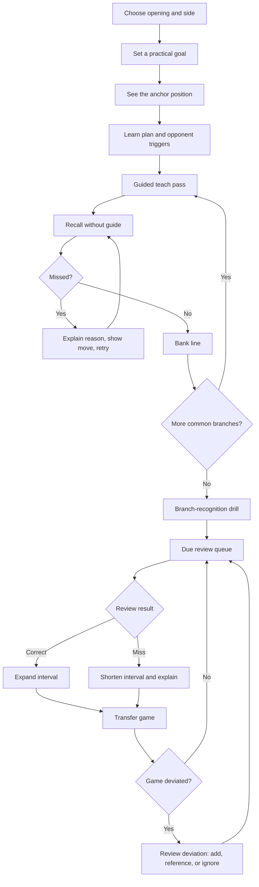

# Chess-opening learning research

Research date: 2026-07-29

Scope: first-party product pages, help centers, manuals, and official Lichess/Aimchess pages. This captures documented product behavior and vendor-described learning methods; it is not an independent ranking of effectiveness.

## Short synthesis

- The strongest common loop is **explain or demonstrate → retrieve a move from a position → give immediate correction → schedule the position again**.
- Opening content is modeled as a **branching repertoire**, not a flat move list. Main lines, side lines, key moves, reference lines, depth, and branch-level review are explicit controls.
- Good systems separate **trainable material** from **reference material**. This keeps full games and sidelines available without making every move part of the review burden.
- Progress has at least three layers: learning state for each move/position, coverage of the repertoire tree, and practical results or deviations in real games.
- Onboarding works best as a constrained starting choice: side, opening/repertoire, depth, and a first session. A guided path can coexist with direct search and branch access.

## Product evidence

### Chessable / MoveTrainer

Chessable’s current MoveTrainer behavior is documented in the official Chess.com Help Center. Opening courses are interactive repertoires with annotations and visual aids such as highlighted squares and colored arrows, not just videos or static books ([MoveTrainer courses](https://support.chess.com/en/articles/10318195-what-are-movetrainer-courses)).

- Retrieval and spaced repetition are explicit. Correct answers lengthen the interval; mistakes shorten/reset it. The documented approximate levels run from 4 hours, 1 day, 3 days, 1 week, 2 weeks, 1 month, 3 months, to 6 months. Each move has its own timer, so one weak move can remain due inside an otherwise learned variation ([scheduling](https://support.chess.com/en/articles/10319322-how-does-the-spaced-repetition-scheduling-work)).
- Review is configurable: learned-order spaced repetition, course order, or random variation; standard, hard, and extra-hard difficulty change what an incorrect move does to mastery; a walkthrough can precede the quiz ([course settings](https://support.chess.com/en/articles/10319078-how-do-i-manage-my-course-settings)).
- Branch compression is built in. “Key moves” let an author start training from an important point instead of repeating all lead-in moves; a variation can have up to two key moves ([key moves](https://support.chess.com/en/articles/10319325-what-are-key-moves)). Reference lines remain searchable but never become due for review ([reference lines](https://support.chess.com/en/articles/10319315-what-are-reference-lines)).
- The product surfaces manageable scope: its help guidance recommends mastering the current review load before adding more material ([too many moves](https://support.chess.com/en/articles/10319168-i-constantly-have-too-many-moves-to-review-can-i-adjust-this)).

**Pattern to reuse:** per-position scheduling, explicit trainable/reference separation, and author-controlled “start here” points for long variations.

### Chess.com

Chess.com combines a curriculum, opening-specific practice, and post-game feedback.

- Opening Practice asks for an opening, color, and line, then uses a bot that plays the required moves; the learner can set engine strength. A linked Learn tab provides an opening lesson ([Practice](https://support.chess.com/en/articles/8724749-what-is-practice-on-chess-com)). This is useful for applying a repertoire against a responsive opponent rather than only recalling isolated cards.
- The Learn Path uses coach explanations plus interactive challenges, with four skill levels and visible locked/available/completed states. The Lesson Library supports direct search/filtering by topic, level, theme, or instructor, so guided onboarding and self-directed navigation coexist ([Lessons](https://support.chess.com/en/articles/8609703-how-do-lessons-work-on-chess-com)).
- Its official beginner opening plan sequences principles, practical games, a small set of tournament openings, lesson/article/video review, thematic games, an opening lesson, and a quiz ([opening study plan](https://www.chess.com/article/view/study-plan-for-beginners-the-opening)). The plan explicitly favors a small repertoire and practical use before exhaustive theory.
- Game Review closes the feedback loop: it identifies the opening and last book move, shows opening results, suggests a course, classifies moves, and offers Retry at key moments with coach feedback ([Game Review](https://support.chess.com/en/articles/8584089-how-does-game-review-work)).
- Opening Stats expose win/loss/draw rates, color/time/date filters, expandable move trees, and a mini-board ([opening stats](https://support.chess.com/en/articles/8705347-how-can-i-see-my-opening-stats)).

**Pattern to reuse:** let learners move from curriculum to line practice to real-game review, and show progress in both learning status and practical opening outcomes. The standard Opening Practice surface is bot/line practice; the documented spaced-repetition behavior belongs to MoveTrainer courses.

### Lichess

Lichess is strongest as an open analysis, authoring, and discovery substrate rather than a single curated opening course.

- The official Openings browser exposes a searchable name tree and an Explorer with speed and rating filters ([Openings](https://lichess.org/opening)). This supports repertoire discovery and population-specific branching, but the page itself does not prescribe a learning path.
- Studies save moves, variations, comments, symbols, and arrows. One study can contain many chapters, each with its own starting position and move tree; chapters can hide moves so learners guess them. Studies also expose computer evaluation and opening explorer data ([official Study announcement](https://lichess.org/@/lichess/blog/study-chess-the-lichess-way/V0KrLSkA)).
- The official Practice catalog shows a progress percentage and modular interactive lessons, with sign-in required to save progress ([Practice](https://lichess.org/practice)). On the page reviewed, the catalog is focused on checkmates, tactics, and endgames rather than an opening-specific spaced-repetition course.

**Pattern to reuse:** preserve a full annotated tree and let a learner enter it as a guessing exercise at selected chapters or positions. Do not infer that an opening database or study tree alone supplies scheduling, explanations, or onboarding; those must be added by the product.

### Aimchess

Aimchess uses a game-data-first model: the learner does not begin by choosing a complete repertoire. After sign-up, it analyzes recent games, measures six areas including opening performance, and compares the learner with players at the same rating ([Aimchess overview](https://aimchess.com/)).

- Its Opening Improver finds positions where the learner played an incorrect opening move and asks them to learn the best move. Retry Mistakes uses the same retrieval principle across past errors ([Aimchess overview](https://aimchess.com/)).
- Personalization is the organizing layer: the service advertises a weekly study plan, daily training session, warm-up, mistake-derived puzzles, and lessons from grandmasters/coaches ([Aimchess overview](https://aimchess.com/)).
- Onboarding can be a username from a chess platform or a 25-position, 10-minute quiz when the learner has no connected games ([Try Aimchess](https://aimchess.com/try/account)).

**Pattern to reuse:** use actual games to select opening positions and expose recurring mistakes. Aimchess is evidence for adaptive diagnosis and retry, not for a learner-authored opening tree or a documented opening-specific SRS schedule.

### ChessTempo Opening Trainer

ChessTempo is the clearest first-party example of a dedicated repertoire manager plus trainer. A learner creates white/black repertoires by entering moves or importing PGN, then trains the whole repertoire or a selected branch ([Opening Trainer](https://chesstempo.com/opening-training/); [manual, Opening Training](https://chesstempo.com/manual/en/manual.html#17-opening-training)).

- It offers three training modes: spaced repetition, review in order, and least-recent/unseen first. Correct moves move farther into the future; incorrect moves are shown again quickly, often within the same session ([manual, training modes](https://chesstempo.com/manual/en/manual.html#17-4-3-available-training-modes)).
- Branching is first-class: train a branch, set maximum depth, choose depth-first, breadth-over-depth, main-lines-first, or common-positions-first priorities, and enable or disable alternative lines on import ([manual, repertoire and priorities](https://chesstempo.com/manual/en/manual.html#17-2-pgn-import)).
- Explanations attach to positions/moves through comments, annotations, and engine evaluations. The trainer also integrates with online play to show exactly where a game deviated and help expand the repertoire from real opponent lines ([Opening Trainer](https://chesstempo.com/opening-training/)).
- Progress is more granular than a single course percentage: the manual documents learning-status/history graphs and a sunburst view that can color moves by accuracy, correct streak, last seen, next scheduled review, opening-explorer data, or engine evaluation ([manual, sunburst](https://chesstempo.com/manual/en/manual.html#17-8-opening-sunburst-repertoire-visualisation)).

**Pattern to reuse:** combine a position tree, multiple queue policies, branch/depth controls, and post-game deviation capture. This is a strong reference for a user-owned repertoire rather than a publisher-owned course.

### Listudy and Openingtrainer.com

These smaller opening-specific products show two useful alternatives.

- Listudy presents openings as repertoire play plus systematic spaced repetition, with a minimal open-source/free product surface ([Listudy](https://listudy.org/en)).
- Openingtrainer.com treats practice more like a focused game. It requires no signup to start, samples opponent moves according to Lichess frequencies, gives each opening variant its own rating and progress charts, and asks the learner to analyze mistakes rather than immediately handing over the answer ([Openingtrainer](https://openingtrainer.com/)).

**Pattern to reuse:** alternate deliberate recall with realistic opponent sampling. A per-opening rating or chart can motivate practice, but it should not replace line coverage, accuracy, and review-due metrics.

## Cross-product design implications

For an opening-practice product, the smallest evidence-backed loop is:

1. **Teach:** show the position, move, plan, and opponent reply with optional arrows/annotations.
2. **Recall:** hide the guide and require the learner to choose or play the move from the position.
3. **Explain:** after the attempt, show the expected move, why it matters, and the relevant plan/threat; allow a retry.
4. **Schedule:** maintain a timer per practice position. Expand intervals after success; resurface mistakes quickly.
5. **Branch:** store opponent replies and alternative learner responses as a tree. Support main-line, breadth, depth, and branch-only sessions.
6. **Ground in play:** record where a real game leaves the repertoire and turn recurring deviations into targeted review.
7. **Report:** show due items, learned/seen coverage, accuracy or correct streak, average depth, and results by opening/side/line.

Onboarding should start with side and a deliberately narrow repertoire or course branch, then offer a first guided session. Full-tree imports, engine analysis, and rare sidelines can remain available as reference until practice data justifies making them trainable.

## Source list

- [Chessable / MoveTrainer courses](https://support.chess.com/en/articles/10318195-what-are-movetrainer-courses)
- [MoveTrainer spaced-repetition scheduling](https://support.chess.com/en/articles/10319322-how-does-the-spaced-repetition-scheduling-work)
- [MoveTrainer course settings](https://support.chess.com/en/articles/10319078-how-do-i-manage-my-course-settings)
- [MoveTrainer key moves](https://support.chess.com/en/articles/10319325-what-are-key-moves)
- [MoveTrainer reference lines](https://support.chess.com/en/articles/10319315-what-are-reference-lines)
- [Chess.com Practice](https://support.chess.com/en/articles/8724749-what-is-practice-on-chess-com)
- [Chess.com Lessons](https://support.chess.com/en/articles/8609703-how-do-lessons-work-on-chess-com)
- [Chess.com Game Review](https://support.chess.com/en/articles/8584089-how-does-game-review-work)
- [Chess.com opening stats](https://support.chess.com/en/articles/8705347-how-can-i-see-my-opening-stats)
- [Chess.com beginner opening study plan](https://www.chess.com/article/view/study-plan-for-beginners-the-opening)
- [Lichess Openings](https://lichess.org/opening)
- [Lichess Study announcement](https://lichess.org/@/lichess/blog/study-chess-the-lichess-way/V0KrLSkA)
- [Lichess Practice](https://lichess.org/practice)
- [Aimchess](https://aimchess.com/)
- [Aimchess onboarding quiz](https://aimchess.com/try/account)
- [ChessTempo Opening Trainer](https://chesstempo.com/opening-training/)
- [ChessTempo manual](https://chesstempo.com/manual/en/manual.html#17-opening-training)
- [Listudy](https://listudy.org/en)
- [Openingtrainer.com](https://openingtrainer.com/)

## Recommended learning map

## Best-practice lesson flow

### 1. Entry: make the promise concrete

Show the opening name, side, anchor position, three practical plans, the first common opponent decisions, and a small session estimate. Primary action: **Start lesson**. Secondary actions: **Browse lines** and **Practice due reviews**.

Do not lead with ECO codes, engine scores, a full opening tree, or a large theory dump. Those are reference material, not the reason to start.

### 2. Concept pass

Before asking for memory, answer:

1. What is this position trying to achieve?
2. What is the opponent threatening or preparing?
3. What is the first decision the learner must make?
4. What plan follows after the common reply?

Keep each explanation short and position-specific. Put deeper notes behind progressive disclosure.

### 3. Guided teach pass

The learner plays their side with the guide visible. Opponent moves play automatically. Use the app's Move Beat to let the reply register and keep Tempo Cut available for learners who want to continue immediately.

The teach pass is orientation. It must not inflate accuracy or be treated as recall.

### 4. Immediate recall pass

Replay the same line from the start with the guide hidden. After a miss:

- explain the concrete reason in one sentence;
- show the expected move only after the attempt;
- allow a retry;
- count a hint as assisted, not clean recall;
- keep the recovery path obvious instead of resetting the whole course.

### 5. Branch recognition

After the core line is banked, start at the position where the opponent diverges and ask, “They played X. What is our plan now?” Prioritize common/practical branches. Classify content as:

- **Core** — must be recalled;
- **Alternative** — equivalent response, both acceptable;
- **Reference** — understand it, do not schedule it;
- **Punish** — recognize the opponent error and know the simple response.

This prevents every annotated move from becoming equal memory debt.

### 6. Spaced review

Review due positions, not necessarily complete courses. Use position-level scheduling so one stubborn move can be practiced without replaying a 20-move branch. Expand intervals after clean recall and shorten them after a miss. Mix branches only after the relevant guided and recall passes are complete.

The exact intervals are tunable policy. The important invariant is expanding review after success and rapid resurfacing after failure.

### 7. Transfer to a game

After the core branch is learned, offer a bot or practice-game mode. After the game, identify the last in-repertoire position and the first deviation. Distinguish “the learner forgot the line” from “the opponent played an uncovered move,” then offer **Add to repertoire**, **Keep as reference**, or **Ignore**.

## UX rules

- Keep the board dominant during practice; hide long notes, deep engine lines, and rare branches behind progressive disclosure.
- Label the state clearly: **Learn**, **Recall**, **Review**, **Study**, or **Practice game**.
- Make feedback local and useful: “Not the repertoire move. Play Nf6: it develops with tempo and keeps the centre flexible.”
- Hide hints until requested. Escalate from plan → destination → full move rather than revealing everything immediately.
- Make progress answer “what next?”: “3 positions due,” “1 line needs recall,” or “weak spot: 4...c5.”
- Keep free study and engine exploration progress-neutral. The existing Browse & Study screen already follows this rule.
- Offer both a guided path for new learners and direct branch access for experienced learners.
- Use the Eval Bar as context, not as the lesson's only explanation. Authored plans and consequences should come first.

## Fit with this repository

Already present and worth preserving:

- `courses.ts`: course, lesson, variation, position, explanation, summary, and source metadata;
- `LineDrill`: `teach`, `recall`, and `review` Drill Phases, retry behavior, and hints;
- `LessonRunner`: ordered lines, banking, session summary, and review entry;
- `review-schedule.ts`: position records, due state, review streaks, and interval policy;
- `mastery.ts`: line, course, and overall mastery;
- Browse & Study: read-only line walkthrough;
- Eval Bar, Move Beat, and Tempo Cut.

Smallest useful next changes:

1. Add content roles: `core`, `alternative`, `reference`, and `punish`.
2. Add a compact lesson-idea block: anchor position, plan, opponent trigger, and resulting plan.
3. Add branch-point review after the core line is banked.
4. Ensure every scored miss has a short authored “why this move” explanation, with engine output secondary.
5. Make the post-lesson recommendation exactly one next action: continue, review due positions, or play a transfer game.
6. Later, add game-deviation import and branch approval. Defer a full course editor and full opening database until usage proves they are needed.

## What to measure

- first-try recall rate per position;
- assisted recall rate;
- retention after one day and one week;
- due positions completed per session;
- time from lesson start to first clean recall;
- branch confusion rate at shared decision positions;
- percentage of learners reaching a transfer game;
- post-game deviations accepted as repertoire branches;
- exit rate after a miss or a long explanation.

Do not use engine evaluation or a single course-completion percentage as the primary learning metric. They describe position quality or activity, not whether the learner can recall and apply the opening.
